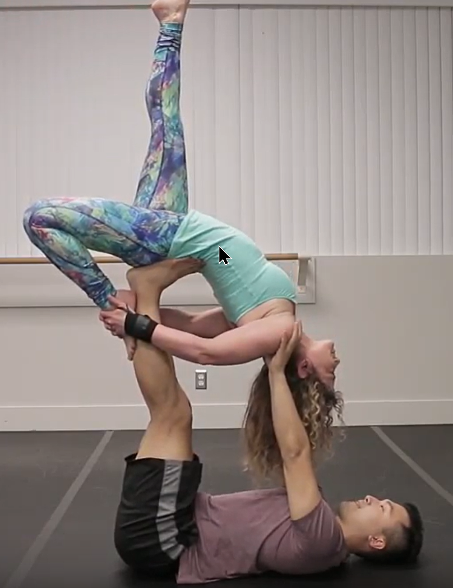
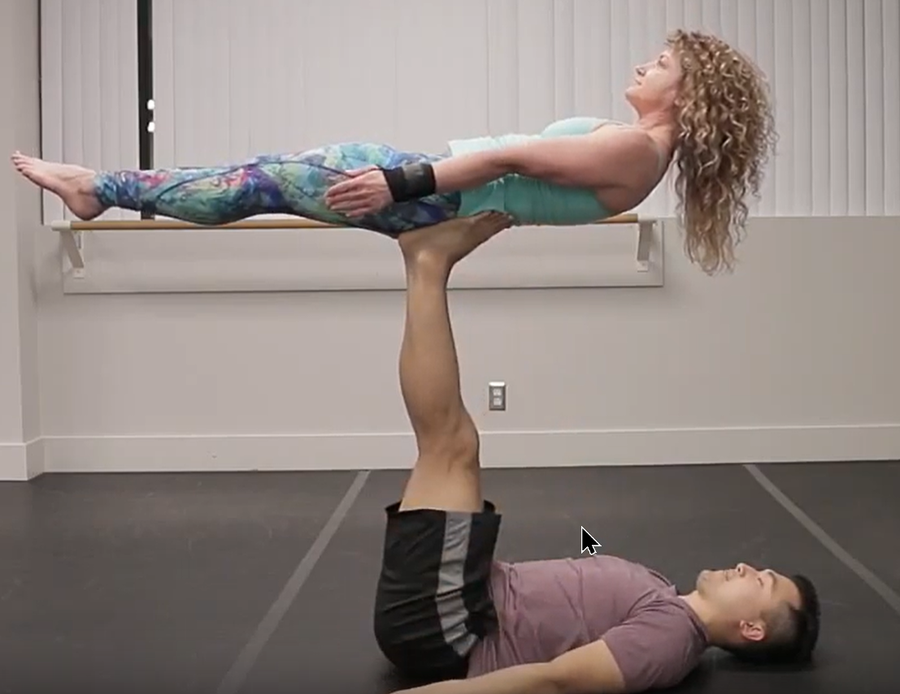

## Drills

[super dave video](https://www.youtube.com/watch?v=qa5iG6k3W0s)

## Entries - Exits

- standing ←→ back bird [video](https://youtu.be/qa5iG6k3W0s?t=36)
- back bird ← (pop) → [Reverse Bird](/wiki-circo/reverse-bird) [video](https://www.youtube.com/watch?v=UekRYMSAfmQ&list=PL1-kCAzj6UZ_MG_J7ElrDzlkHbeFokjXJ&index=22&t=0s)

:::section{.variantes}

## Variantes

- 
  _Bow pose_

- 
  _Dancers pose_

- 
  _Back plank_

- 
  _Boat pose_

:::
