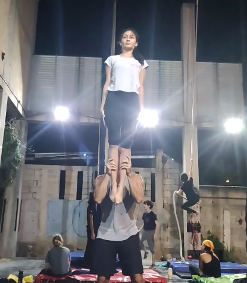

## Other videos

Elevador --> F2H [video](https://www.instagram.com/p/BzJrlB9nPJn/)

### Base 

- Keep your hands at a slight angle.
- Keep your hands straight above your ellbow.

### Flyer 

- Hold a straight and tighten up your body.
- Keep your legs hip width apart.
- Relax your feet.
- Look to the horizon (and smile).

### Spotter 

- Stand on the side
- Reach for the upper body or hips of the flyer.

## Drills

[no drills yet]()

:::section{.variantes}

## Variantes

<!-- - _trick name_ -->

- _calf stand_

:::
