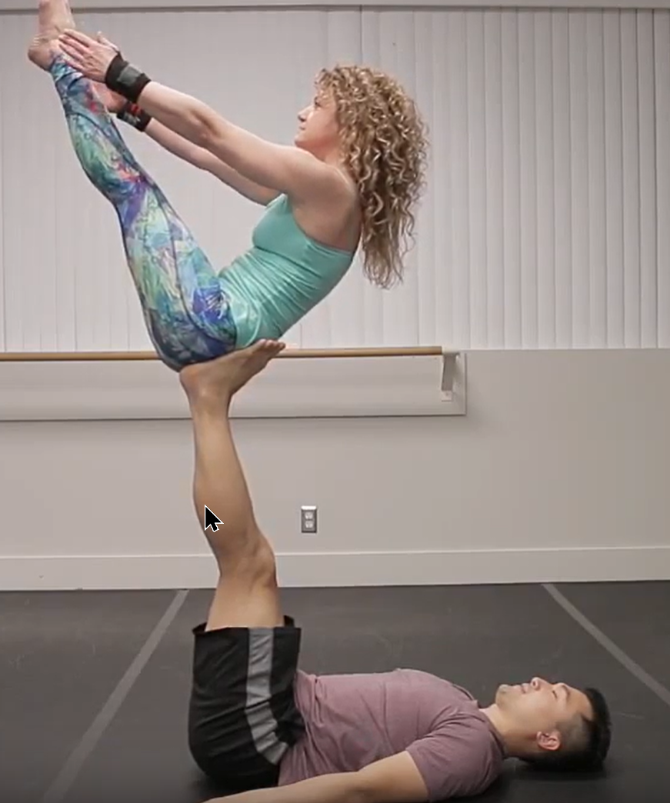

# Back Bird

**Imagen - Video**

**Ejercicios**

[super dave video](https://www.youtube.com/watch?v=qa5iG6k3W0s)

**Entradas - Salidas**

- standing ←→ back bird [video](https://youtu.be/qa5iG6k3W0s?t=36)
- back bird ← (pop) → [Reverse Bird](/wiki-circo/reverse-bird) [video](https://www.youtube.com/watch?v=UekRYMSAfmQ&list=PL1-kCAzj6UZ_MG_J7ElrDzlkHbeFokjXJ&index=22&t=0s)

**Variantes**

- Bow pose
  

- Dancers pose
- 

- Back plank

- Boat pose

